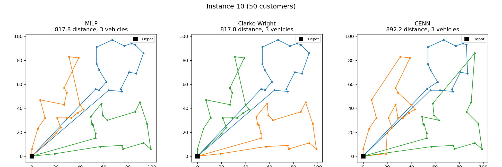
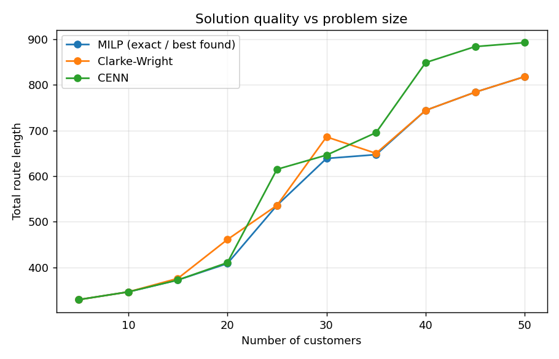
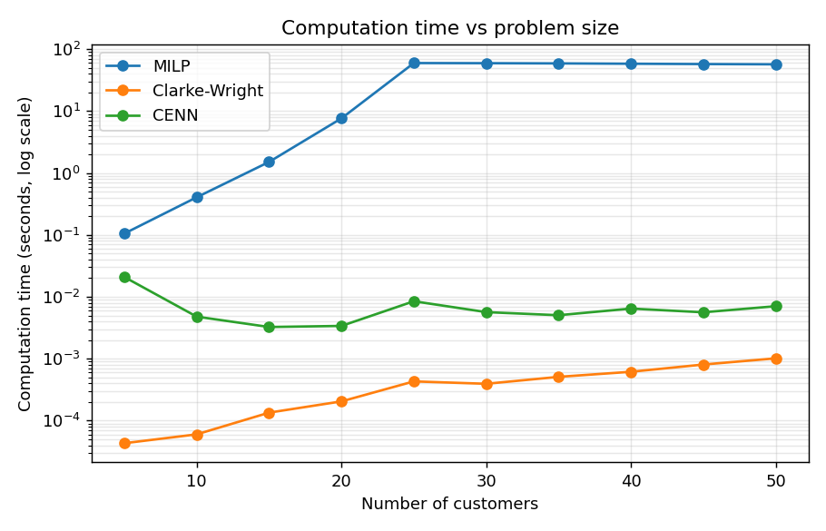

# Solving the Vehicle Routing Problem: Exact vs Heuristic Methods

A comparison of three ways to solve the **Capacitated Vehicle Routing Problem (CVRP)**, originally built as a course project for *IE 2551 – Algorithms and Computations* and later cleaned up, debugged and re-run.



## The problem

A fleet of identical trucks starts at a depot at (0, 0). Each truck can carry **200 units**. There are *n* customers, each with a location and a demand. Every customer must be visited exactly once, no truck may carry more than its capacity, and every truck returns to the depot. **Goal: minimise the total distance driven.**

This problem is NP-hard. The number of possible route plans explodes as customers are added, so exact methods quickly become too slow and practical systems rely on heuristics.

## The three methods

| Method | Type | Idea |
|---|---|---|
| **MILP** | Exact | Write the problem as a mixed-integer linear program (two-index formulation with Miller–Tucker–Zemlin constraints) and solve it with the free CBC solver via PuLP. Guarantees the best answer, given enough time. |
| **Clarke-Wright Savings** | Classic heuristic | Start with one route per customer. Repeatedly join the two routes whose merge saves the most distance, as long as capacity allows and both customers are at the ends of their routes. |
| **CENN** (Cluster-Enhanced Nearest Neighbor) | Custom heuristic | 1) Group customers with k-means (one cluster per truck) and repair any cluster that is over capacity. 2) Build each route with Nearest Neighbor. 3) Polish each route with 2-opt. |

## Results

10 instances from 5 to 50 customers. The MILP got a 60-second time limit per instance and was given the best heuristic answer as a starting point.

| Instance | Customers | MILP | CW | CW gap | CENN | CENN gap | MILP time (s) | CW time (s) | CENN time (s) |
|---|---|---|---|---|---|---|---|---|---|
| 1 | 5 | 329.55 | 329.55 | 0.0% | 329.55 | 0.0% | 0.1 | 0.0000 | 0.0209 |
| 2 | 10 | 346.54 | 346.54 | 0.0% | 346.54 | 0.0% | 0.4 | 0.0001 | 0.0048 |
| 3 | 15 | 372.55 | 376.04 | 0.9% | 372.55 | 0.0% | 1.5 | 0.0001 | 0.0033 |
| 4 | 20 | 408.59 | 461.16 | 12.9% | 410.57 | 0.5% | 7.6 | 0.0002 | 0.0034 |
| 5 | 25 | 535.93* | 535.93 | 0.0% | 614.88 | 14.7% | 59.7 | 0.0004 | 0.0085 |
| 6 | 30 | 638.68* | 685.86 | 7.4% | 646.01 | 1.1% | 59.4 | 0.0004 | 0.0057 |
| 7 | 35 | 647.04* | 649.85 | 0.4% | 695.19 | 7.4% | 59.0 | 0.0005 | 0.0050 |
| 8 | 40 | 743.93* | 743.93 | 0.0% | 848.53 | 14.1% | 58.2 | 0.0006 | 0.0065 |
| 9 | 45 | 783.74* | 783.74 | 0.0% | 883.53 | 12.7% | 57.5 | 0.0008 | 0.0056 |
| 10 | 50 | 817.78* | 817.78 | 0.0% | 892.21 | 9.1% | 57.0 | 0.0010 | 0.0071 |

\* The MILP hit its time limit, so this is the best solution found, not a proven optimum. "Gap" is how much longer the heuristic's routes are than the MILP's.

<p float="left">
  
  
</p>

### Key findings

- **The exact method hits a wall fast.** MILP proved optimality for up to 20 customers, with solve time growing from 0.1 s to about 8 s. As soon as more than one truck was needed (25+ customers), it couldn't finish within 60 seconds.
- **Heuristics are thousands of times faster.** Both heuristics solve every instance in under 0.03 s.
- **Clarke-Wright is the most reliable heuristic here**, finding the best-known solution on 6 of 10 instances. Its weak spots were single-truck instances (4 and 6) where greedy merging locks in a poor tour order.
- **CENN shines when there is only one truck** (within 0.5% of optimal for 5–20 customers), thanks to 2-opt. With several trucks, k-means clustering ignores where the depot is, which produces awkward groupings, and that is where it falls behind.

## What changed from the original course version

Re-running the original code revealed several bugs, which are fixed here:

1. **MILP didn't enforce vehicle capacity.** The load variable `u[i]` had no upper bound, so the capacity constraint never did anything. Instance 5 (demand 251 vs capacity 200) was "solved" with a single overloaded truck. Fixed by bounding `demand[i] ≤ u[i] ≤ capacity` and requiring trucks leaving the depot to equal trucks returning.
2. **Clarke-Wright merged routes in the wrong places.** It glued routes together without checking that the two customers were at the ends of their routes, producing results up to 56% worse than optimal. With the proper endpoint check it is 0% off on most instances.
3. **Inconsistent capacity.** The heuristics used capacity 500 while the MILP and the report used 200. Everything now uses 200.
4. **CENN wasn't actually implemented.** The code was plain Nearest Neighbor; the clustering and 2-opt steps from the write-up were missing. Both are now implemented.
5. **Timing showed 0.0 seconds.** `time.time()` is too coarse for millisecond runs; switched to `time.perf_counter()`.
6. **No validation.** Every solution is now automatically checked (each customer visited once, no truck overloaded).

The headline conclusion changed as a result: the original report concluded that CENN beat Clarke-Wright at scale, but with both algorithms implemented correctly, Clarke-Wright comes out ahead on the larger instances.

## How to run it

You'll need Python 3.9 or newer.

```bash
git clone https://github.com/<your-username>/vrp-heuristics.git
cd vrp-heuristics
pip install -r requirements.txt

python run_experiments.py               # full run, about 6 minutes (MILP gets 60 s per instance)
python run_experiments.py --skip-milp   # heuristics only, about 1 second
python run_experiments.py --milp-time-limit 10
```

Results and plots are saved in the `results/` folder.

## Project structure

```
vrp-heuristics/
├── run_experiments.py     # runs everything, saves tables and plots
├── requirements.txt
├── vrp/
│   ├── instances.py       # the 10 test problems
│   ├── utils.py           # distances, route length, solution checker
│   ├── milp.py            # exact method (PuLP + CBC)
│   ├── clarke_wright.py   # Clarke-Wright Savings heuristic
│   └── cenn.py            # Cluster-Enhanced Nearest Neighbor heuristic
└── results/               # output table (CSV + Markdown) and plots
```

## Ideas for future work

- Cluster by angle around the depot (the "sweep" method) instead of k-means, so clusters fan out from the depot.
- Add inter-route moves (relocating or swapping customers between trucks) to the refinement phase.
- Try metaheuristics such as Simulated Annealing or Tabu Search.
- Use a stronger exact formulation or a commercial solver (e.g. Gurobi) to prove optimality for larger instances.

## References

1. Clarke, G., & Wright, J. W. (1964). Scheduling of Vehicles from a Central Depot to a Number of Delivery Points. *Operations Research*, 12(4), 568–581.
2. Dantzig, G. B., & Ramser, J. H. (1959). The Truck Dispatching Problem. *Management Science*, 6(1), 80–91.
3. Laporte, G. (2009). Fifty Years of Vehicle Routing. *Transportation Science*, 43(4), 408–416.
4. Toth, P., & Vigo, D. (2002). *The Vehicle Routing Problem*. SIAM.

## Author

Süleyman Batu Sarı. Originally built for IE 2551 – Algorithms and Computations.
